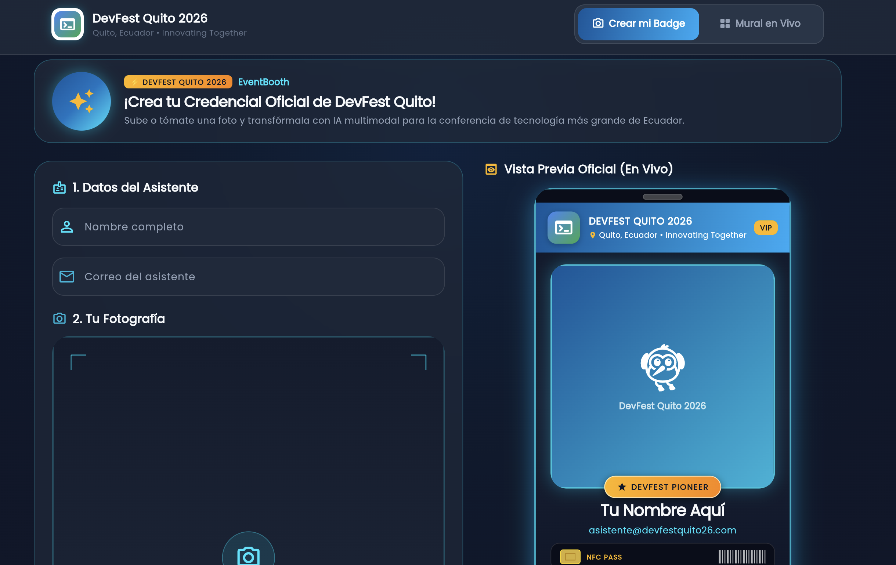
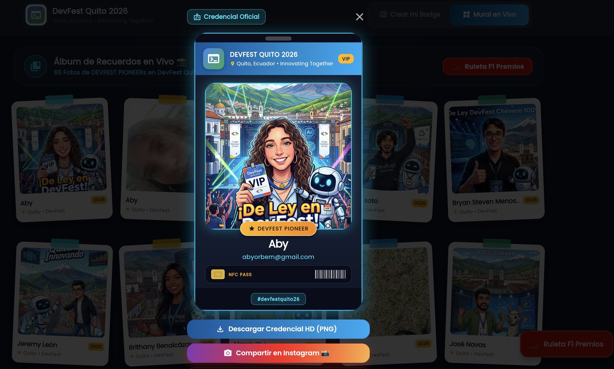
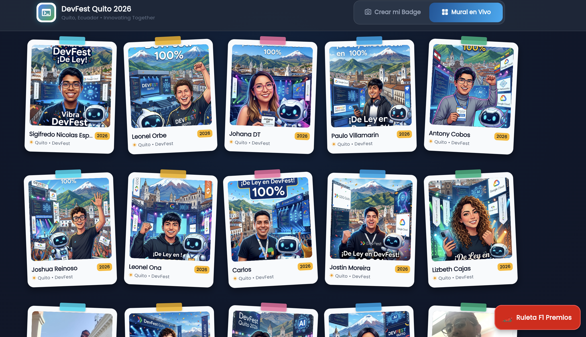
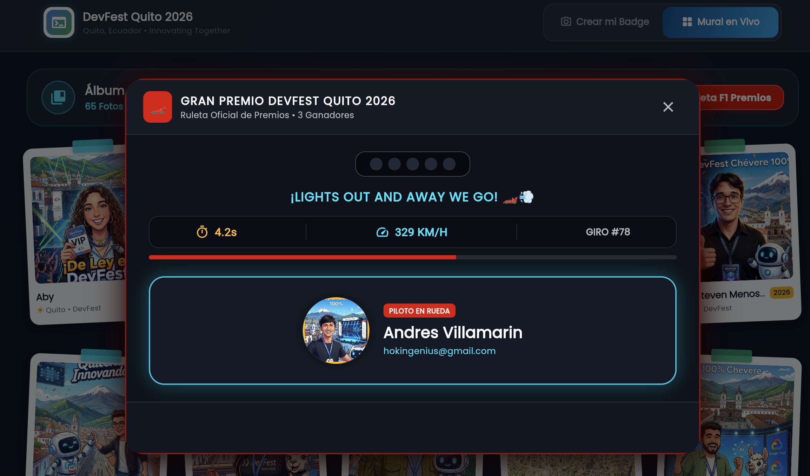
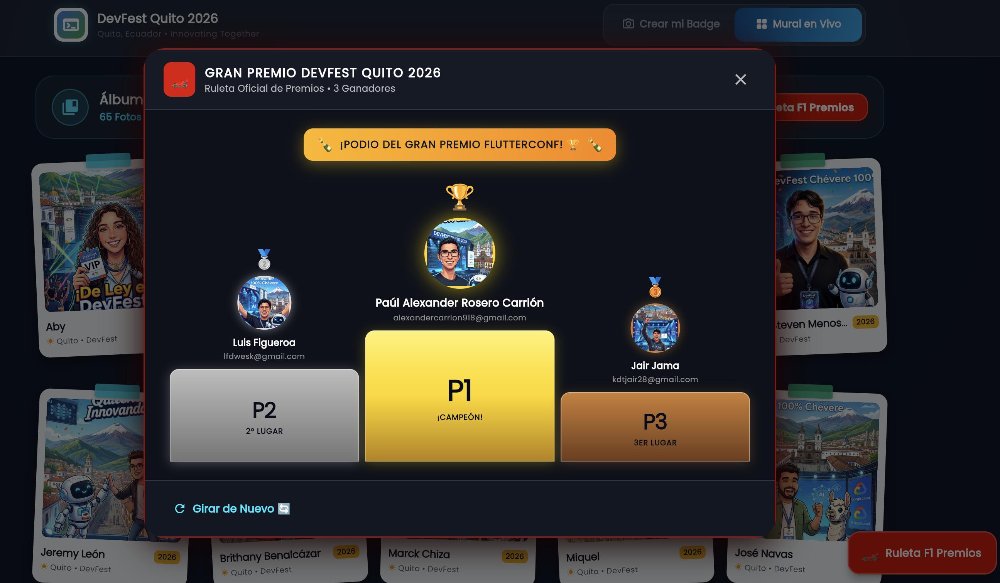

# 📸 EventBooth — Open-Source AI Photobooth & Badge Platform

[](https://flutter.dev)
[](https://aistudio.google.com)
[](docs/tech-stack.md)
[](test/)
[](LICENSE)
[](https://event-booth-2026.web.app)

> 🌐 **Live Demo:** [https://event-booth-2026.web.app](https://event-booth-2026.web.app)

---

## 🌟 What is EventBooth?

**EventBooth** is a production-grade, open-source Flutter Web application designed for tech conferences, meetups, hackathons, and community summits.

EventBooth transforms traditional event check-ins and photo booths into an unforgettable, gamified experience:
- **Zero-Auth Onboarding**: Attendees scan a QR code or visit the URL on any mobile device or desktop browser without downloading an app or creating an account.
- **Multimodal AI Badges**: Captures or uploads a photo and uses **Gemini 3.1 Flash Image** to render a personalized, high-definition badge celebrating your event's theme, city, and culture.
- **Real-Time Community Wall**: Displays all attendee credentials on a live, collaborative photo album with real-time updates.
- **Formula 1 Grand Prix Prize Roulette**: A high-energy gamified raffle spinner that reveals 3 lucky winners on an authentic 3-tiered podium (P1, P2, P3).
- **Secret Admin Control Room (`/admin`)**: A PIN-protected dashboard allowing organizers to dynamically brand the entire event in under 60 seconds—customizing logos, hero mascots, prompts, Gemini API keys, exporting attendees to CSV, and wiping the album between event days.
- **Real-Time Bilingual Support**: Instant one-click toggle between **English (🇺🇸)** and **Spanish (🇨🇴)** with live UI updates across all screens.

---

## 📸 Screenshots & Walkthrough

### 1. Photobooth & Live Badge Generator
*Interactive responsive camera viewfinder, file uploader, attendee details, and real-time badge preview with holographic borders.*



---

### 2. High-Definition Badge & Social Sharing
*Download high-resolution PNG badges and share directly to Instagram and social networks with event hashtags and dynamic role pills.*



---

### 3. Real-Time Community Photo Wall
*Live collaborative photo gallery streaming newly generated badges with organic scrapbook tilts, hover straightening animations, and modal detail views.*



---

### 4. Formula 1 Grand Prix Prize Roulette & 3D Podium
*Gamified raffle modal with high-speed attendee cycling, starting lights, and a celebratory 3-tiered podium with confetti.*



---

### 5. Secret Admin Configuration Room
*PIN-protected control room to configure branding, custom logos, hero mascots, Gemini AI prompt templates, custom API keys, instant presets, attendee CSV exports, and community album maintenance.*



---

## ✨ Key Features

### 🎨 100% Configurable per Event
- **Instant Theming**: Customize Event Name, Tagline, Location, Official Hashtag, Badge Role Pill (`DEVFEST PIONEER`, `TECH PIONEER`, `VIP ATTENDEE`), and Community Album Tagline.
- **Visual Asset Management**:
  - Live 70x70 preview boxes with loading indicators and error fallbacks.
  - Paste any public image URL (HTTPS, CDN, Drive, Imgur) or upload files directly to Cloud Storage.
  - One-click reset to generic conference defaults.
- **Built-in Presets**: Switch instantly between presets (Quito 2026, Cancún 2026, and Generic Event) with automatic preservation of custom administrator credentials.

### 🤖 Gemini AI Multimodal Integration
- Powered by Google's **Gemini 3.1 Flash Image** via Firebase Vertex AI and Google AI Studio REST APIs.
- **Custom Gemini API Key**: Event organizers can paste their own free Gemini API key from [Google AI Studio](https://aistudio.google.com) directly in the Admin Panel without changing code or rebuilding.
- **Customizable Prompt Templates**: Adjust the multimodal prompt with dynamic tags (`{name}`, `{eventName}`, `{location}`, `{hashtag}`) and regional phrases catalog.

### 📊 Community Album & Data Management
- **One-Click CSV Export**: Export all registered attendees (`Nombre,Email,Evento,Fecha`) to a `.csv` file formatted with UTF-8 BOM (``) for perfect compatibility with Microsoft Excel and Google Sheets.
- **One-Click Album Reset**: Delete all cards safely with an irreversible confirmation modal using Cloud Firestore chunked 500-batch operations.

### 🌐 Real-Time Bilingual Internationalization (i18n)
- Seamless real-time switching between **English (🇺🇸)** and **Spanish (🇨🇴)**.
- Covers navigation, form validation, photobooth steps, community wall, F1 roulette, and the entire admin dashboard.

### 📱 Responsive & Zero-Auth Architecture
- Fluidly scales from 320px mobile viewports up to 4K conference hall projectors.
- Zero login friction: attendees jump straight into creating their badge.

---

## 🚀 Quickstart Guide

### Prerequisites
- [Flutter SDK](https://flutter.dev/docs/get-started/install) (version 3.24 or higher)
- [Git](https://git-scm.com)
- Modern Web Browser (Google Chrome, Safari, Firefox, Edge)

### 1. Clone & Run Locally
```bash
# Clone the repository
git clone https://github.com/jggomez/photo-booth.git
cd photo-booth

# Give execution permissions and launch
chmod +x run-locally.sh
./run-locally.sh
```

Or run directly with Flutter:
```bash
flutter pub get
flutter run -d chrome --web-port 8080
```
Open [http://localhost:8080](http://localhost:8080) in your browser.

---

### 2. Access the Secret Admin Panel
1. Navigate to [http://localhost:8080/#/admin](http://localhost:8080/#/admin) or tap the ⚙️ gear icon in the top header.
2. Enter the default administrator PIN: **`2026`**.
3. Configure your event details, upload your logo, paste your Gemini API key, and hit **"Guardar Configuración en Vivo" / "Save Live Configuration"**.
4. Changes take effect across all connected devices in real time via Cloud Firestore!

---

### 3. Deploy to Firebase Hosting

You can deploy EventBooth to your own Firebase project in two commands:

```bash
# 1. Build optimized production web bundle
flutter build web --release

# 2. Deploy hosting and security rules
firebase deploy --only hosting,firestore:rules,storage
```

---

## 🏛️ Architecture & Clean Code

EventBooth strictly adheres to **Clean Architecture** and **SOLID principles**:

```text
lib/
├── domain/                  # 100% Pure Dart — Core business logic
│   ├── entities/            # EventConfig, UserCard, BadgeDraft, AiBadgeResult
│   ├── repositories/        # Repository interfaces (IEventConfigRepository, IUserCardRepository, IAiBadgeService)
│   └── usecases/            # GenerateAiBadge, ClearCommunityWall, SaveEventConfig, WatchEventConfig
├── data/                    # Data Layer & Infrastructure
│   ├── models/              # DTOs (EventConfigModel, UserCardModel) with Firestore serialization
│   ├── datasources/         # Firestore (AppConfig, UserCards), Firebase Storage, AI Remote DataSource
│   └── repositories/        # Concrete repository implementations
└── presentation/            # Presentation & UI Layer
    ├── localization/        # AppStrings dictionary for English & Spanish
    ├── providers/           # Riverpod state notifiers, streams, and dependency injection
    ├── screens/             # MainHomeScreen, PhotoboothScreen, CommunityWallScreen, AdminConfigScreen
    ├── widgets/             # OfficialBadgeCard, CommunityBadgeItem, F1RouletteDialog, LanguageFlagToggle
    └── utils/               # WebImageDownloader, WebCsvExporter, SocialShareService
```

### Key Engineering Standards
- **Zero `dart:io` Imports**: Fully compatible with Flutter Web and CanvasKit/Wasm runtimes.
- **Memory Safety**: All `TextEditingController`, `AnimationController`, and `StreamSubscription` instances are strictly disposed.
- **100% Automated Test Coverage**: Unit tests for use cases and models; widget tests with mocked dependencies.

---

## 🧪 Running Automated Tests

```bash
# Run static analysis
dart analyze

# Run all automated tests
flutter test
```

---

## 🤝 Contributing & Community

Contributions, issues, and feature requests are welcome! Feel free to check the [issues page](https://github.com/jggomez/photo-booth/issues).

---

## 📄 License

This project is licensed under the **Apache License 2.0** — see the [LICENSE](LICENSE) file for details.
